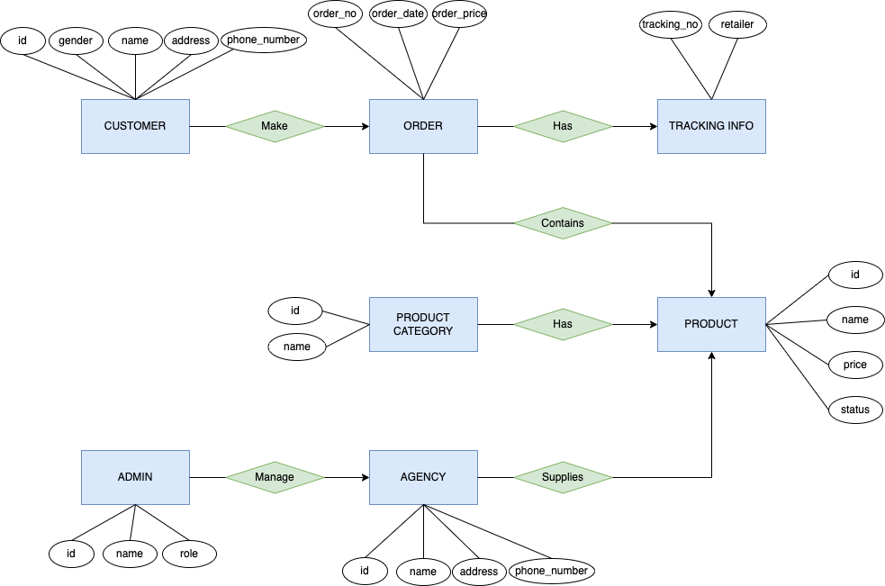
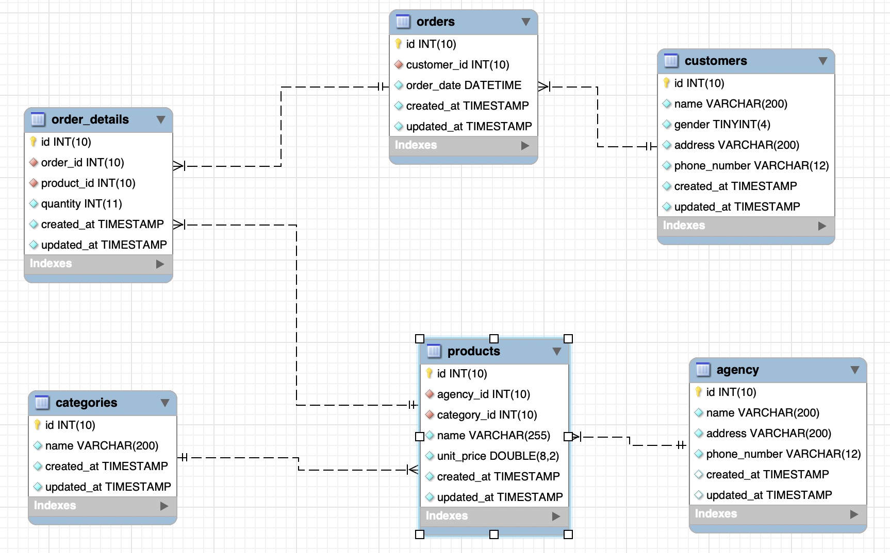

# coding-challenge-udt

### [Assignments link](https://gitlab.com/udt-public-group/php-laravel-test-sheet/-/blob/main/UDT_Backend_PHP_Laravel_Testsheet.pdf)

## Section1: Algorithm
[test.php](algorithm/test.php) 

## Case Study: System design, implementation, deployment

### Section 1

#### ERD Diagram

### Section 2

1. What database are you using?

   Ans: I would like to choose MySQL

2. Why using MySQL?

   Ans: 
   - First, SQL databases are a better fit for heavy duty or complex transactions because it’s more stable and ensure data integrity -> Then I choose SQL over NoSQL
   - Secondly, MySQL works natively with PHP and MySQL is an open-source, it's free to use. -> Then I choose MySQL over SQLServer
    
3. Setup docker-compose.yml to start database locally

   

4. Setup Laravel
   - Folder Structure:

    
   - Homepage Laravel
   
   

5. Implementation

   5.1. Database Design
   

   5.2 APIs implementation
   

### Section 3

1. Authentication and authorize sequence diagram
   
2. Before implement these feature, let's update a bit database
   
   - Changed things:
     - Add user_authentication to verify user.
     - Add role table.
     - Add access token table to store auth state.

   
